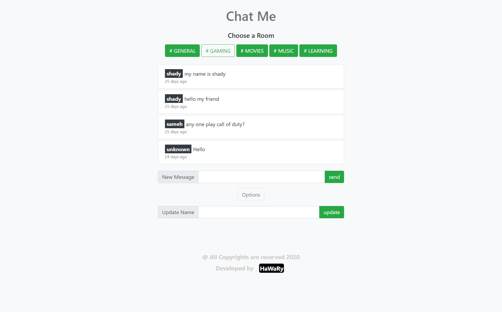

# Chat Me

Chat Me is a Realtime Group Conversation App. depending on Firestore(NoSQL Database) from Firebase Platform., it contains Multi Chat Rooms in different Categories & Fields so they can match your interest. 
  

## Getting Started

You can try the APP from [here](https://mohamed-elhawary.github.io/chat-me/)

## Prerequisites

Just Modern Browser like "Chrome" and a Code Editor for Deployment and Develop.

## Built With

* HML5
* CSS3
* ES6  

## Framework

* [Bootstrap](https://getbootstrap.com/)  

## Database  

* [Firestore (No.SQL Database)](https://firebase.google.com/)  

## JS Libraries  

* [date-fns](https://date-fns.org/)  

## Features  

- Ability to add or update your name before or during chating.  

## Author

* Mohamed Elhawary  

## Contact Me  

* Email: mohamed.k.elhawary@gmail.com

## Deploy with Me

Feel Free to Deploy it with me, send Issues or a Pull Request and i'll deal with you, just test it First.

## License

Licensed under the [MIT License](LICENSE)

